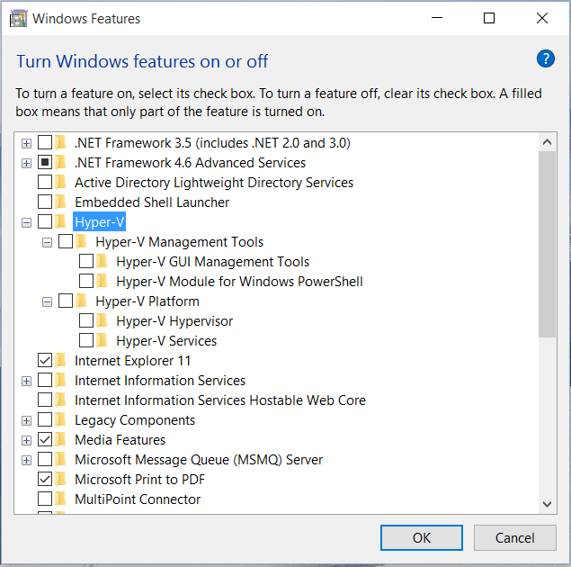
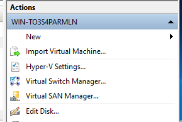
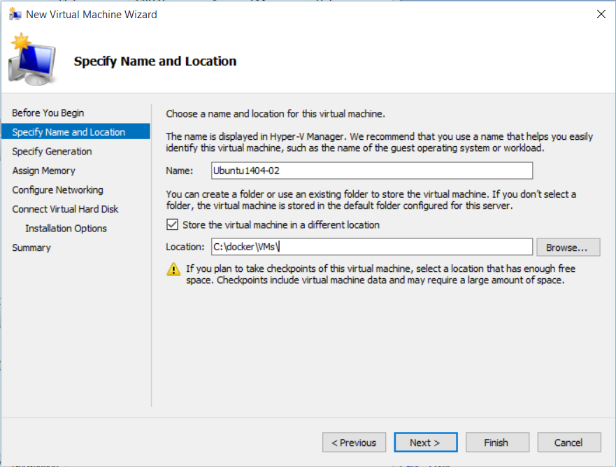
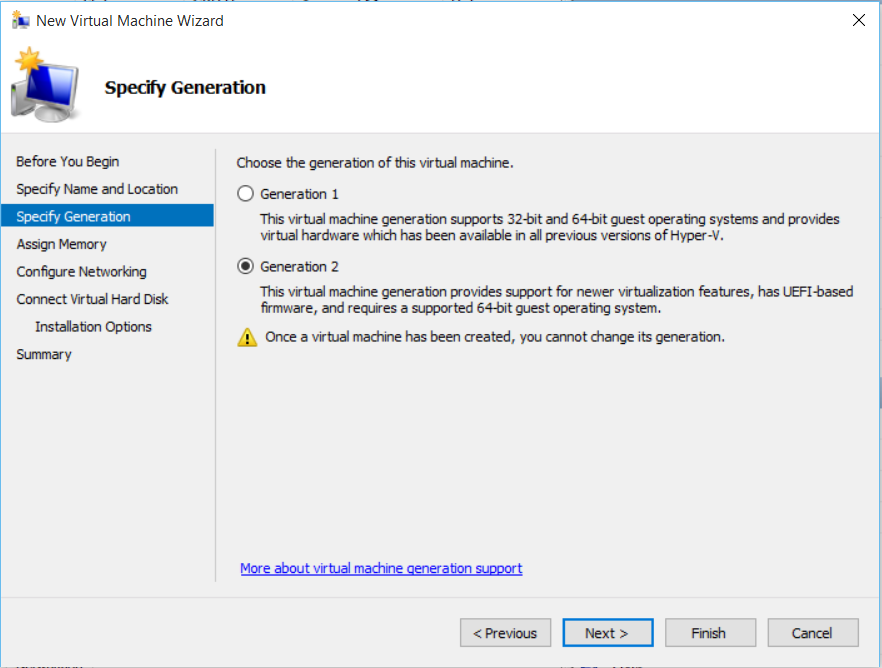

#Setting up Hyper-V

In order to install Hyper-V go to the Control Panel > Programs > Turn Windows features on or off, 
and from there select Hyper-V with all its components and click OK to finish the installation.

Once Hyper-V is installed we need to configure a Virtual Switch so the VM can get external network access.
From Actions, on the right hand side, click Virtual Switch Manager

From the Virtual Switch Manager menu select an external network adapter that has access to the internet (wifi or wired)
as shown below.

Now that a Virtual Switch has been created we can begin the configuration of a virtual machine, 
which we'll use to run Ubuntu.

Enter a Name and select a location for the virtual machine.

We need to run Ubuntu in 64-bit mode, so select "Generation 2" option.

Specify an approriate amount of memory that the virtual machine can use. 

Then select the Virtual Switch that we created earlier.

Select a Name, location and size for the virtual hard disk. For this lab 10 GBs should be sufficient.

Under Installation Options you can choose to select an ISO, which will be used to install Ubuntu from.
We'll get back to this in the next part about installing Ubuntu, so feel free to skip it by selecting "Install an operation system later".

Now that the virtual machine is configured with memory and hard disk we need to change one last thing.

Select your newly created virtual macine and right-click Settings. From the Firmware option we need to 
remove the "Enable Secure Boot" checkbox otherwise we won't be able to install Ubuntu from the ISO we download from ubuntu.com.

Also, change the Boot order so our virtual hard disk is first, then the DVD Drive with our ISO

We are now ready to install Ubuntu in this virtual machine! Continue to the next part for instructions on how to install Ubuntu.