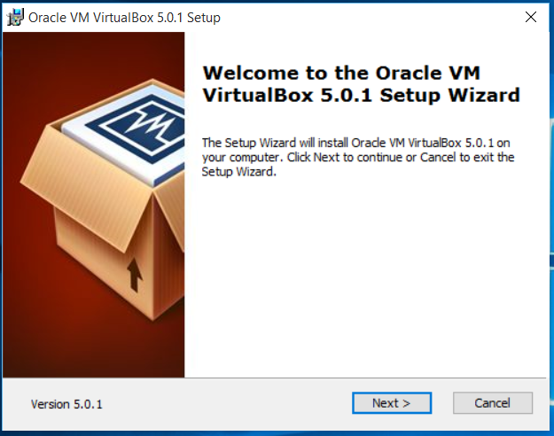
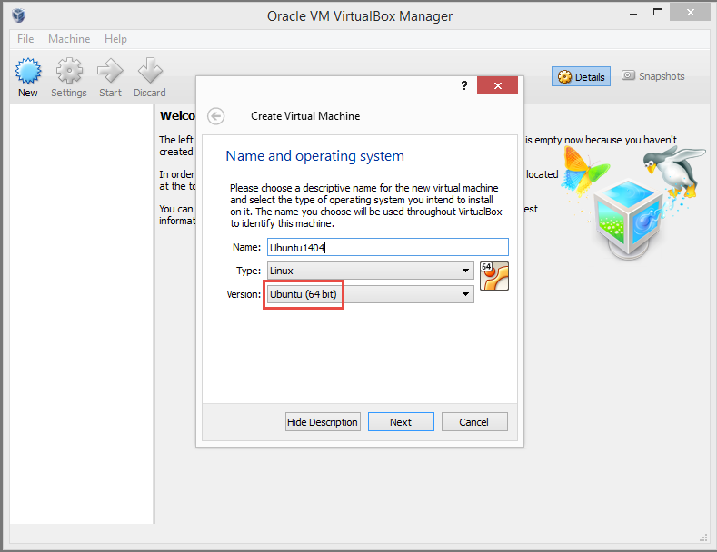
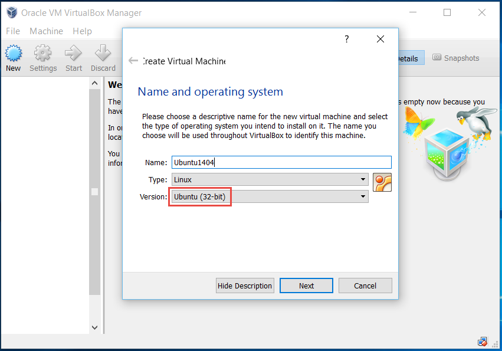
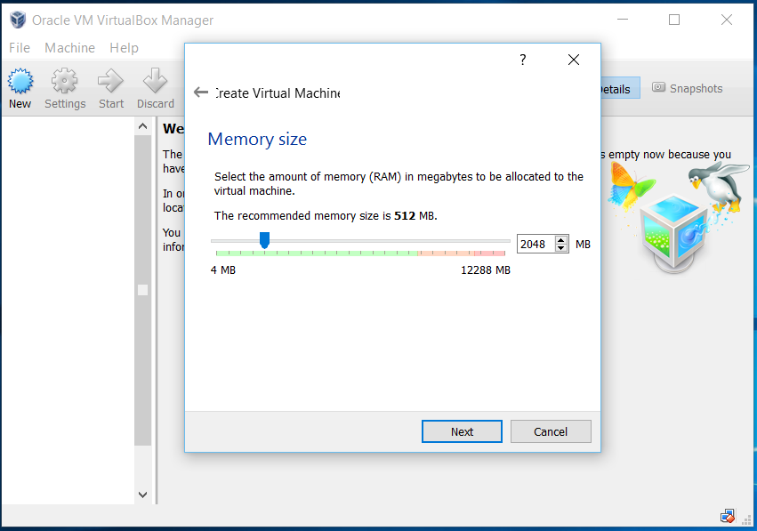
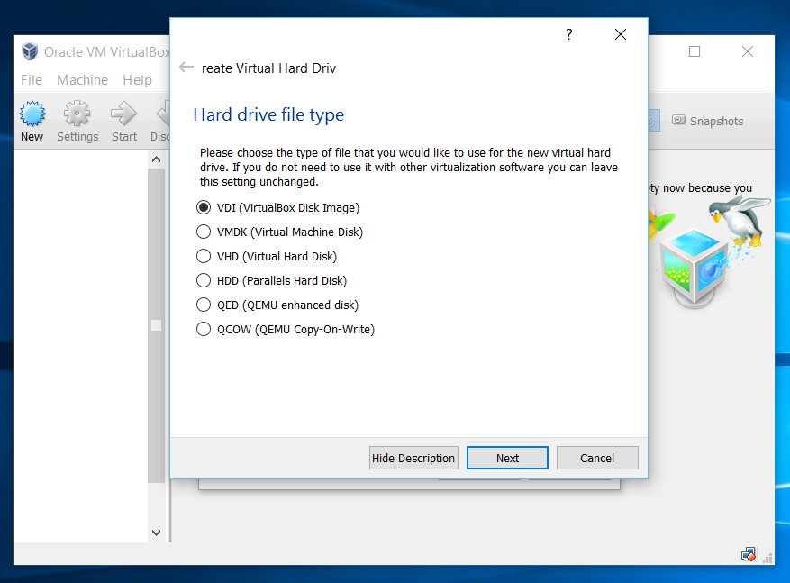
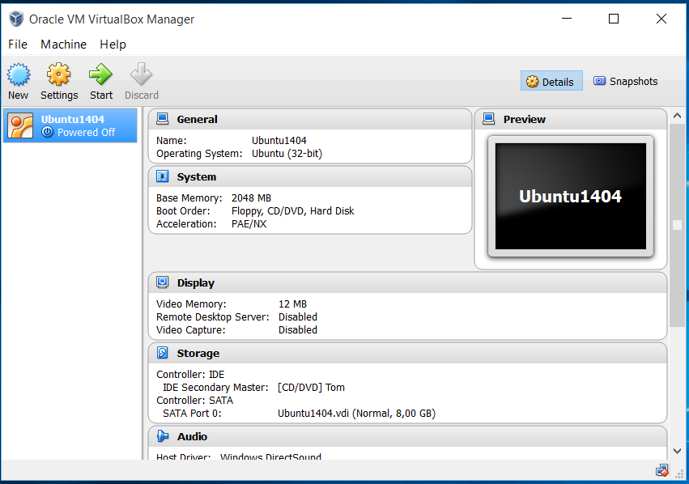

#Setting up VirtualBox

You can get the latest version of VirtualBox for both Windows and Mac OS X on [virtualbox.org](https://www.virtualbox.org/).
 But please note that at the time of writing the latest version of VirtualBox has some known issues with Windows 10.

The installation of VirtualBox is pretty straight forward, simply follow the installer and once its done you need to create and configure a virtual machine.

Click New to start the creation of a new virtual machine. Enter a name and notice how Type and Version is automatically selected when you create Ubuntu.

Please ensure that the Version is a 64 bit version, as the Docker engine only runs on 64-bit architectures.

If your only option is a 32-bit Version of Ubuntu as shown below then you either have Hyper-V enabled (this cannot be enabled when using VirtualBox) or you don't have virtualization correctly enabled.
In your BIOS settings you need both **Intel (R) Virtualization Technology** and **Intel (R) VT-d Feature** enabled.

Next you select an approriate amount of memory for your virtual machine. 2 GB should be sufficient for this Ubuntu machine for our lab.

Then create a new virtual hard drive, which we'll just leave to the default 8 GB

We'll leave the type as a VDI (VirtualBox Disk Image)

How the virtual machine has been created, but we need to configure a few things before we can turn it on and start installing Ubuntu.

Select the newly created virtual machine and click the Settings icon in the menu.

From the Settings menu select Network. The first Adapter is a pre-selected as NAT, which is fine but we need to add a second one. So go to Adapter 2 and enable it.
Then attach the "Host-only adapter" and just leave the name as "VirtualBox Host-Only Ethernet Adapter".

From the Storage option we can select the ISO we'll use to install Ubuntu.

It will look as shown below once the installation image is selected.

Then finally, from the System option, reorder the Boot Order as shown below.

Now we are ready to install Ubuntu, so continue to the next step for instructions on how to install Ubuntu.