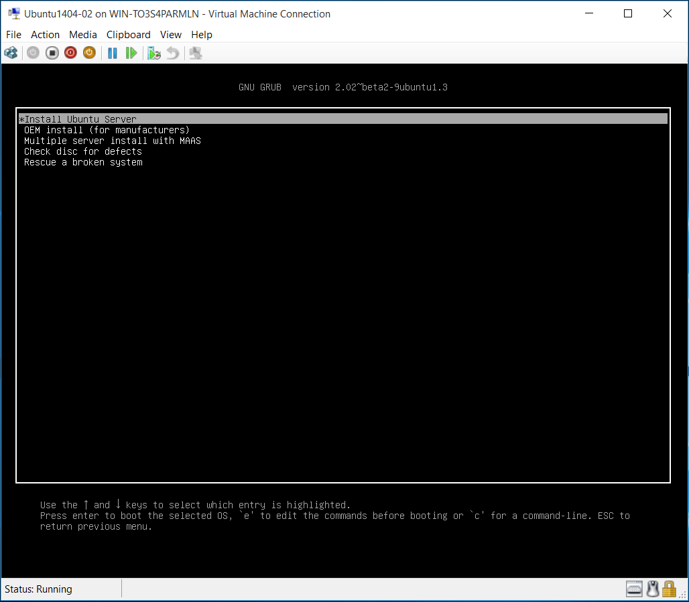
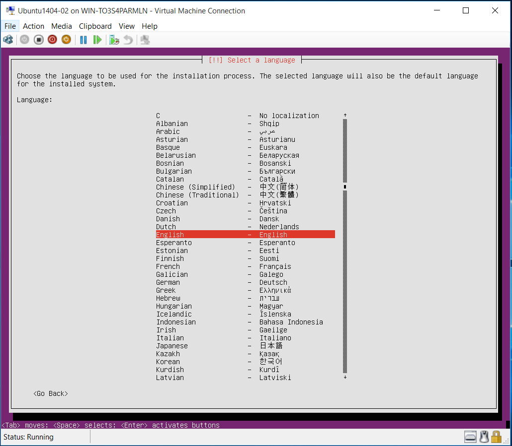
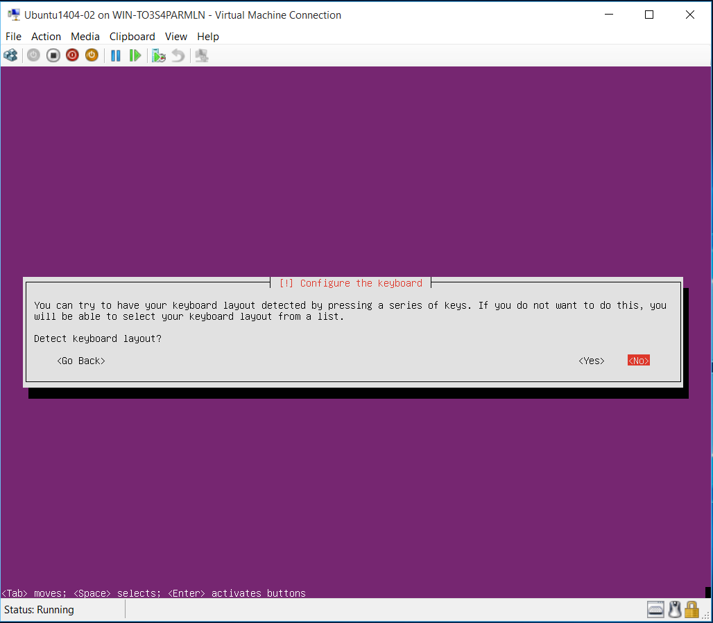
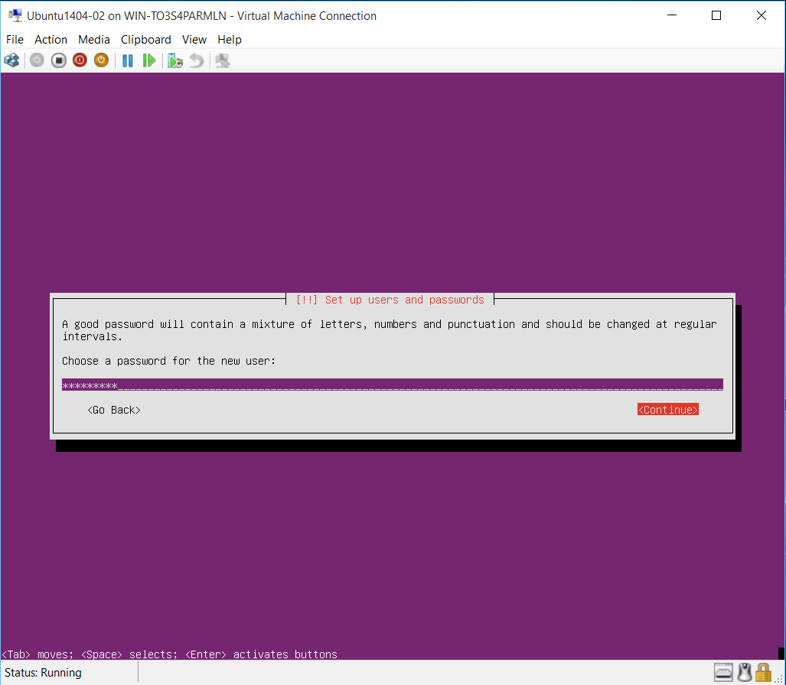
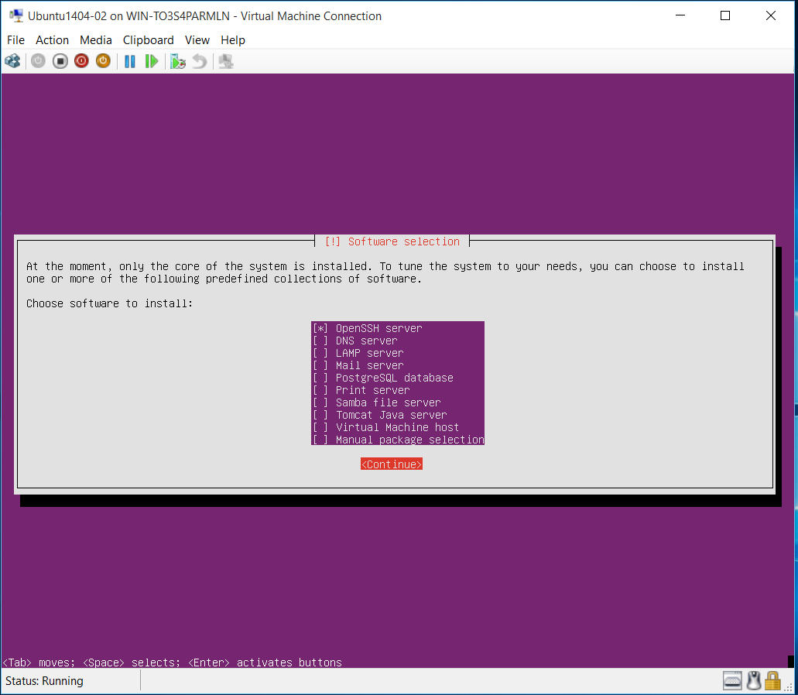
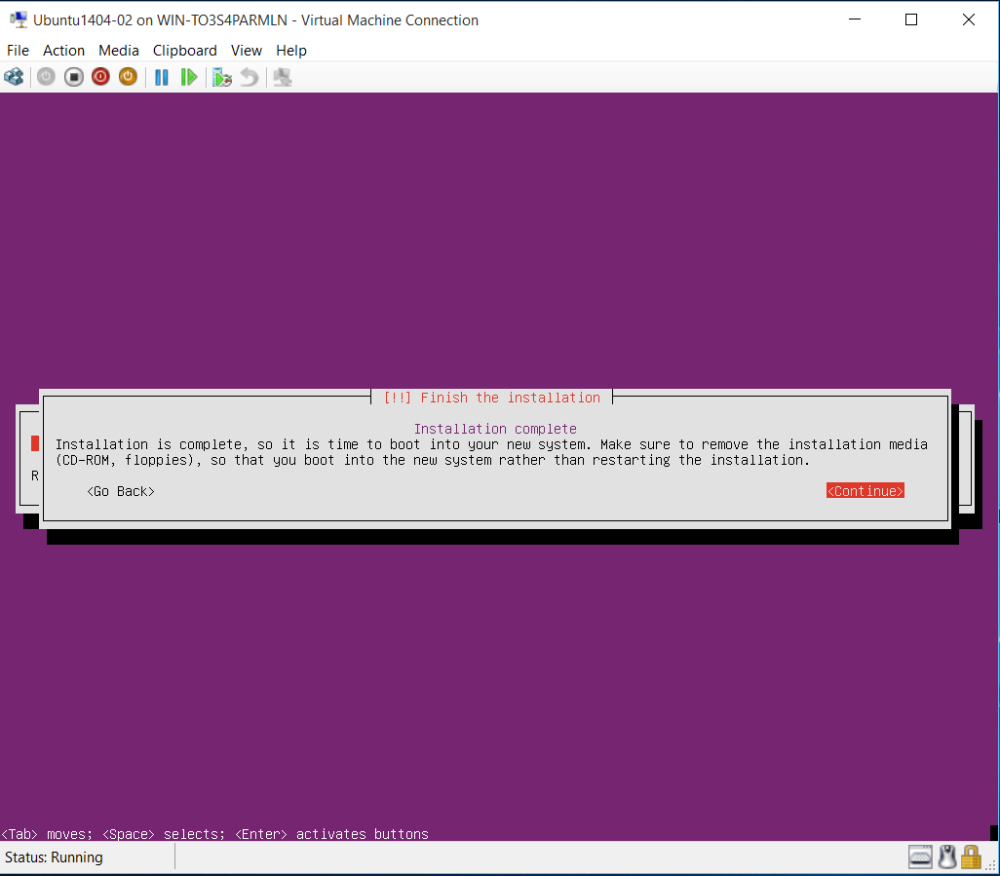
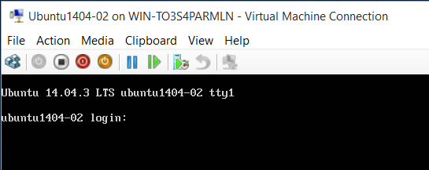
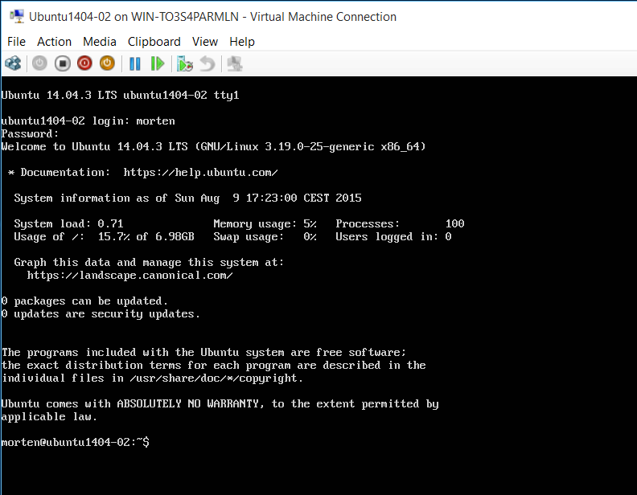

#Installing Ubuntu

Before we can install Ubuntu in our newly create virtual machine we need to download an ISO with the server installation. 
For this lab we'll use Ubuntu version 14-04 LTS (Long Term Support or Long Term Stable), as that corresponds to what is available on Azure.

You can find the latest and greatest Ubuntu server version on [ubuntu.com/download/server](http://www.ubuntu.com/download/server).

Here is a direct download link for Ubuntu Server 14.04.3 LTS: [http://releases.ubuntu.com/14.04.3/ubuntu-14.04.3-server-amd64.iso](http://releases.ubuntu.com/14.04.3/ubuntu-14.04.3-server-amd64.iso)

Once its downloaded you need to attach it as a DVD to the virtual machine before its started. This was shown as a step in the prevous walkthrough of creating either a Hyper-V or VirtualBox virtual machine.

Start the virtual machine with the ISO attached and be amazed by this text-based installer. 
It might look a bit old school, but its pretty straight forward and for this lab we are pretty much just going for the defaults.

So first off select your language of choice.

and your Country (select "other" if you don't see your country in the list).

Then select your keyboard type. Easiest is to just select it from a list.

The Hostname for the Ubuntu server should be the same as the name you gave the virtual machine upon creation. See the highlights in the screenshot below.

First give it your full name for the user account

and then a (short) lower-case name, which will be your actual username.

Choose a password

There is no need to encrypt your home directory for this lab, but you can choose to do so if you like.

Configure and confirm that the selected timezone is correct

We'll use the entire disk from the virtual hard drive for this installation, so choose the same option as is shown in the screenshot below.

Confirm the creation of the partition.

This is usually left blank, unless, of course you are behind a proxy. But that would be unusual for a local lab right.

Since this is a local lab we don't enable automatic updates. Lets avoid any surprises.

Last option is to select any additional software to install. We need SSH for Docker so select the "OpenSSH server" by pressing Space-bar on the select and then "Continue"+enter to finish the installation.

If you select the Hard drive to be above the DVD Drive in the Boot Order you don't need to do anything. Just hit Continue to reboot into the newly installed Ubuntu server.

If everything installed correctly then your virtual machine should boot to something like this.

Now enter your username and password

And you should be logged into your new and freshly installed Ubuntu server

Congratulations!