#Installing Docker in Ubuntu

Now tha twe have Ubuntu up and running in a virtual machine we can continue to install the Docker daemon / engine. 
But first we need to switch to root, as installing Docker requires root privileges. To do this we use the `sudo su` command. 


It is generally said that Docker will run on any Linux distribution, but one caveat is that it has to be a 64-bit Linux distro.
One other caveat is that the kernel version has to be fairly new. A minimum of 3.8 is recommended, but newer then 3.10 is even better.

To check the current version of the kernel run the following command: `uname -a`. 
Luckily, Ubuntu 14.04.3 is using kernel version 3.19, so we are good to go.

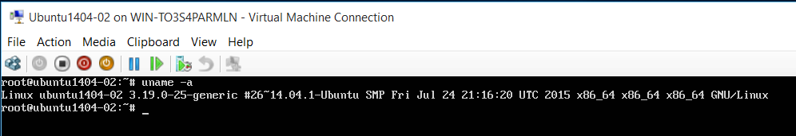

We start off by syncing our package index with sources by running the `apt-get update` command.

> `apt-get` is Ubuntu's packaging tool for installing and removing software. The APT part stands for _Advanced Packaging Tool_.


Now check whether the Docker daemon service is running using the `service docker.io status` command.
Don't worry too much about the name here. Ubuntu (or apt-get) uses docker.io, because they previously had another package called Docker.

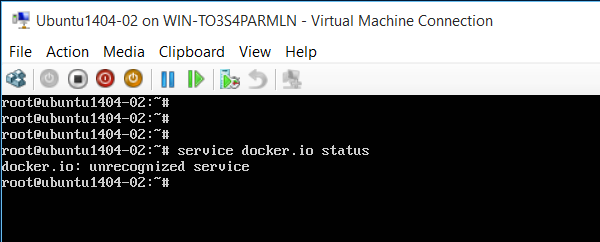

Let's install Docker using the following `apt-get` command:

```
apt-get install -y docker.io
```

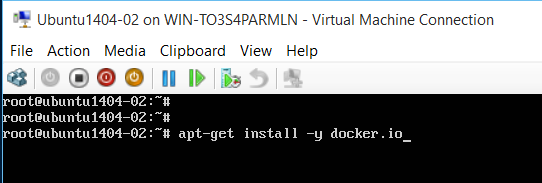

Check that the service is now running with the `service docker.io status` command again.

If the service is running you should see an output similar to that of the screenshot below.

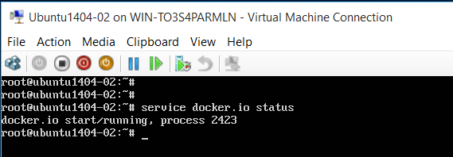

Check the version of Docker that was installed by running the `docker -v` command.

> Use `docker -v` for a short single line version output.
> Use `docker version` for a more detailed overview of the version information.

By default you'll usually get an older version of Docker then what you can download of the docker.com website.

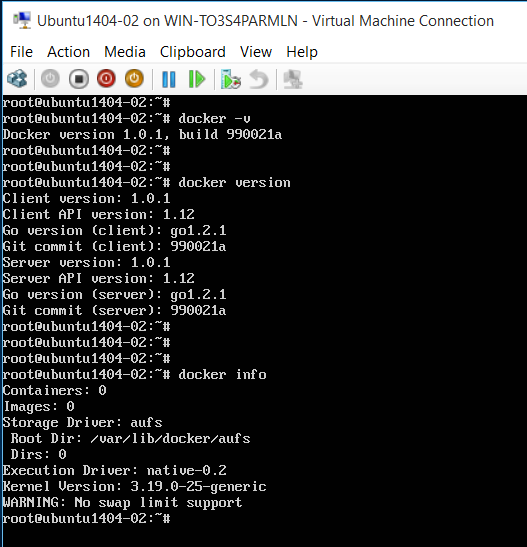

## Updating

Before doing this type of update it's usually a good idea to backup any existing images that we won't to keep.
But since we have just installed and configured this virtual machine there is no reason to do so - at least this time around.

First thing we need to do is to add the Docker repository public key to our local `apt` keychain.
The public Docker repository is where we are going to get the latest version from. 
So start off by typing the following command:

```
wget -qO- https://get.docker.com/gpg | apt-key add -
```


Then followed by add the repository url to the list of apt-sources using the following command:

```
echo deb http://get.docker.com/ubuntu docker main > /etc/apt/sources.list.d/docker.list
```


Then use the `apt-get update` command again in order to sync with the new repository that we just added.

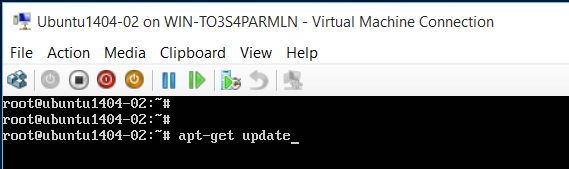

Now we can run the actual installation with the `apt-get install lxc-docker` command.

Again, don't worry too much about the name of the docker package here.

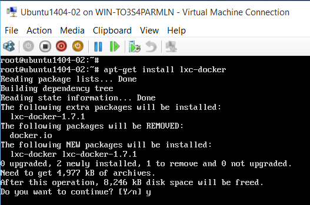

Run the version commands again to verify that Docker has in fact been updated to the latest version.

```
docker -v
docker version
```


## Configure root user for Docker 

Before we continue we need to do a bit of configuration work, as Docker needs root to work and we don't want to be running as root all the time.
So instead we'll add our own (trusted) user to the Docker group.

Run `ls -l /run` and look for *docker.sock*. This is the Unix socket that the Docker daemon listens on.
It also shows the *docker* group and that its owned by root.


To verify that Docker needs root to run we can try out the following command after having exited root.
So first `exit` to return to our user, and then write `docker run -it ubuntu /bin/bash` to start a 
new container with Ubuntu and simply have it from /bin/bash.

You will see the following screen with "permission denied". 

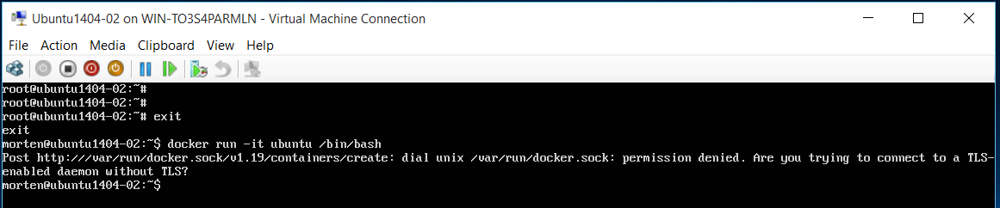

Run `cat /etc/group` to list out all groups. Notice that the docker group doesn't contain your user.


Now run `sudo gpasswd -a <<name of user>> docker` and then enter your password to add your user to the docker group. 

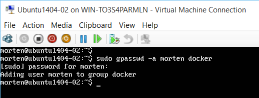

Run `cat /etc/group` again to list out groups, and verify that your user is now added to the docker group.


Run `docker run -it ubuntu /bin/bash` again, and you should now see that Docker starts pulling down the image to run Ubuntu in a local container.

Please note that the user permissions might be cached, so you might need to logout and then login again in order for this to work.

The prompt will switch to root within the container. You can exit the container by writing `exit` or pressing Ctrl + C.


Run `docker ps -a` to verify that the container ran (and exited).


## Configure network port

By default, the Docker daemon listens to a local Unix socket. In this section
we'll change it to listen to a network port instead, so we can interact with
the Docker daemon from our local machine using the Docker client (docker.exe).

First off, use the `netstat -tlp` command to check which services listens to
network ports. Since we are starting fresh you should only see ssh listed here.

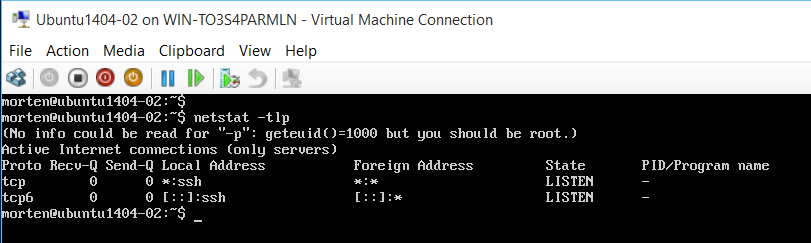

Now, type `ip a` to list IPs for the various network connections. Look for *eth0*
and the IP listed after *inet* - in the screenshot below its 192.168.43.196.

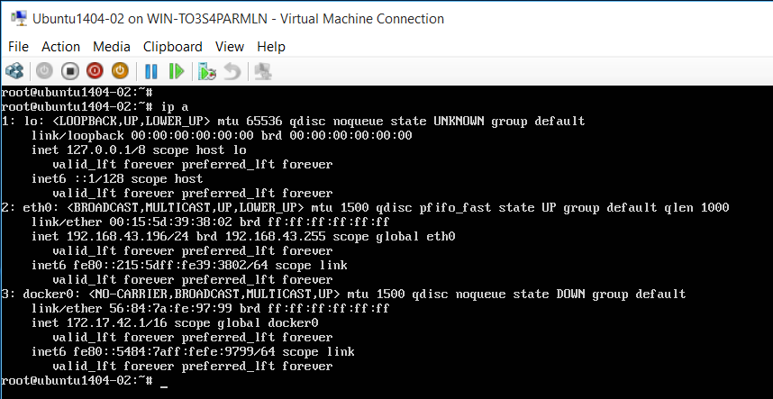

Before we can bind a network port to Docker we need to stop the service by running `service docker stop`.

Then use the following command to attach the network port 
```
docker -H 192.168.43.196:2375 -d &
```
As you can see we are using port *2375*, which is the standard non-SSL Docker port. 
The -d is to put it in daemon mode, and the ampersand is to give us our command prompt back.

> If we wanted to keep the binding on the Unix socket, we could have added another -H option that specified the Unix socket.
> Like so `-H tcp://192.168.43.196:2375 -H unix:///var/run/docker.sock`

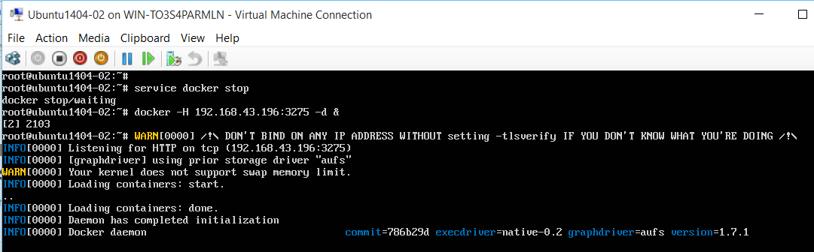

Now, to test that this actually works we'll go back to our machine (not the virtual machine, but our regular Windows machine).
From the command prompt type `export DOCKER_HOST="tcp://192.168.43.196:2375"`, which adds an environment variable with the address to the Docker daemon running in our virtual machine.

Next type `docker version`, which will now show the version of the Docker daemon running in our virtual machine. Note that, because we are running the Docker client on our local Windows PC we don't have a Docker daemon installed locally.


You can also try typing `docker info` in your local command prompt to see more details about the Docker daemon, which is obviously running Ubuntu as shown below (meaning the Ubuntu version we have running in our virtual machine).

One thing to remember is that binding the Docker daemon to a network port potentially allows anyone to connect to the daemon. For this local lab its fine, but keep in mind that you are not providing any username or password when connecting to Docker in the virtual machine. So this is obviously not something we want to resources hosted on Azure.


Thats it for installing and configuring Docker. You can now continue to the next exercise to learn more about Docker.