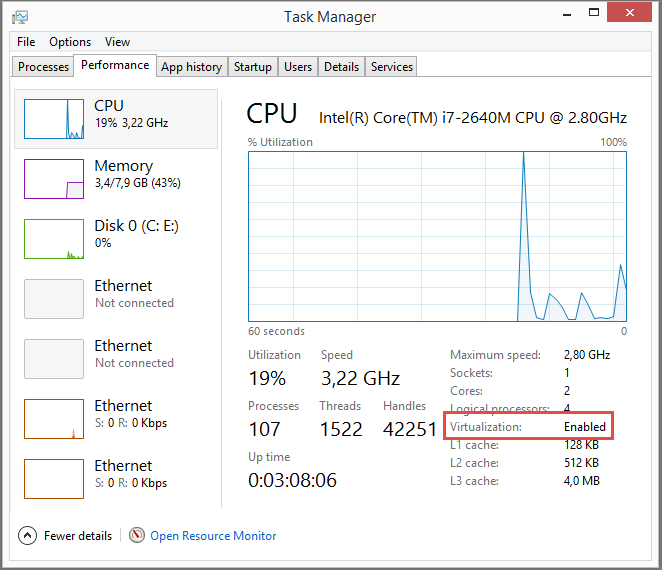

# Getting Started

To get started with Docker we'll setup a local lab that we can use to test and learn 
before we actually deploy anything to Azure. If you already have a lab running locally 
or if you are already familiar with Docker you can skip to Exercise 02 for learning more
about Containers, Commands and Dockerfiles, or skip to Exercise 03 for setting up an 
Azure VM, which can be used for hosting Containers.

Before you continue you need to decide whether to use Hyper-V or VirtualBox for running
a local Ubuntu server installation with the Docker daemon/engine running. If you are running
Windows 8 or 10 Hyper-V might be the easist approach as its available as a Windows feature.
If you are running Windows 7 or Mac OS X then VirtualBox might be a better solution.

Please ensure that you have virtualization turned on, as that is required to run both Hyper-V
and VirtualBox, and please also note that you cannot run the two simultaneously. If you have 
Hyper-V enabled on your Windows PC then you will not be able to run 64-bit VMs in VirtualBox. 

 

Once you have the virtualization part setup you can continue to install Ubuntu and then 
finally Docker in your local virtual machine.

* [Setting up Hyper-V](01-hyperv/README.md)
* [Setting up VirtualBox](01-virtualbox/README.md)
* [Installing Ubuntu](02-ubuntu/README.md)
* [Installing Docker in Ubuntu](03-docker/README.md)