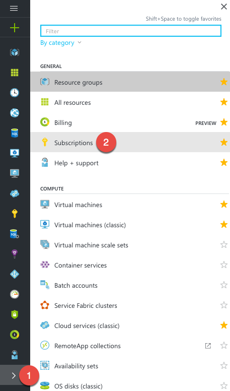
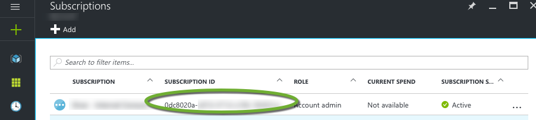

# Docker Machine

Machine lets you create Docker hosts on your local computer through [Hyper-V](https://docs.docker.com/machine/drivers/hyper-v) or [VirtualBox](https://docs.docker.com/machine/drivers/virtualbox), and on range of different cloud providers - which of course includes [Azure](https://docs.docker.com/machine/drivers/azure).

## Preparing

If you haven't already downloaded Docker Machine, you can find the Docker Machine binaries on the github page for Machine [https://github.com/docker/machine/releases](https://github.com/docker/machine/releases).
Download `docker-machine_windows-386.exe` or `docker-machine_windows-amd64.exe` (unblock if necessary), rename it to `docker-machine.exe` and put it in the same folder as the `docker.exe` on your local machine,
so that it will part of the PATH variable that should already configured.

If you have installed Docker on your computer, it is also included in the package - chances are you already have it installed.

Once that is done we need the subscription id for the subscription you want to create a Docker VM.
Go to the [portal](http://portal.azure.com) and navigate to subscriptions:



Then, find the subscription you want and copy the id:




## Using Docker Machine to create an Azure VM

Now everything should be in place for actually creating a virtual machine on Azure using `docker-machine`.

The shortest form of creating a virtual machine on Azure is using the following command, but please note that it will use a lot of defaults

> Name of virtual name must be unique - globally. It is in fact the DNS name you're specifying.
> Since it also is the DNS name, you must be aware that it should be lower case

```cli
$ docker-machine create -d azure --azure-subscription-id="SUB_ID" --azure-location="LOCATION" A-UNIQUE-NAME-FOR-YOUR-VM
```

The `-d` flag is short-hand for driver, and is the part that tells Machine that we are using the Azure driver.

>Valid locations are: "East US", "South Central US", "Central US", "North Europe", "West Europe", "Southeast Asia", "East Asia"

>You can find all the subcommands in the [Docker Machine subcommands](https://docs.docker.com/machine/reference/) reference documentation.

Here is a list of some of the CLI options and environment variables and their default values

| CLI option                      | Environment variable        | Default                |
|:--------------------------------| ----------------------------| -----------------------|
| `--azure-docker-port`           | -                           | 2376                   |
| `--azure-image`                 | AZURE_IMAGE                 | *Ubuntu 14.04 LTS x64* |
| `--azure-location`              | AZURE_LOCATION              | West US                |
| `--azure-password`              | -                           | -                      |
| `--azure-publish-settings-file` | AZURE_PUBLISH_SETTINGS_FILE | -                      |
| `--azure-size`                  | AZURE_SIZE                  | Small                  |
| `--azure-ssh-port`              | -                           | 22                     |
| `--azure-subscription-id`       | AZURE_SUBSCRIPTION_ID       | -                      |
| `--azure-username`              | -                           | ubuntu                 |

Given this information we can refine our creation, so we set the location and the size of the VM.

VM size is important when creating this, you'll find what sizes are available in your region [here](https://aka.ms/azure-regions).
You can also find details about what every size means [here](https://docs.microsoft.com/en-us/azure/cloud-services/cloud-services-sizes-specs).

Lets chose a medium sizes VM with 2 CPU cores and 7GiB of memory; Standard_D2.

In the following command we add "West Europe" as the location, and set "Stabdard_D2" as the size of our VM.

> Name of virtual name must be unique - globally. It is in fact the DNS name you're specifying.
> Since it also is the DNS name, you must be aware that it should be lower case

```cli
$ docker-machine create -d azure --azure-subscription-cert="mycert.pem" --azure-location="West Europe" --azure-size="Medium" A-UNIQUE-NAME-FOR-YOUR-VM
```

Docker machine needs a certificate from Azure to be able to do this, and it will ask you to log in to the devicelogin and give it a one-time-password.

```cli
Running pre-create checks...
(YOUR_VM_NAME) Microsoft Azure: To sign in, use a web browser to open the page https://aka.ms/devicelogin. Enter the code {A OTP} to authenticate.
(workdock) Completed machine pre-create checks.
```

After this, it will start creating the VM:

```cli
Creating machine...
(YOUR_VM_NAME) Querying existing resource group.  name="docker-machine"
(YOUR_VM_NAME) Creating resource group.  location="North Europe" name="docker-machine"
(YOUR_VM_NAME) Configuring availability set.  name="docker-machine"
(YOUR_VM_NAME) Configuring network security group.  name="workdock-firewall" location="North Europe"
(YOUR_VM_NAME) Querying if virtual network already exists.  location="North Europe" name="docker-machine-vnet"
(YOUR_VM_NAME) Creating virtual network.  name="docker-machine-vnet" location="North Europe"
(YOUR_VM_NAME) Configuring subnet.  name="docker-machine" vnet="docker-machine-vnet" cidr="192.168.0.0/16"
(YOUR_VM_NAME) Creating public IP address.  name="workdock-ip" static=false
(YOUR_VM_NAME) Creating network interface.  name="workdock-nic"
(YOUR_VM_NAME) Creating storage account.  name="vhdsqoem3jb3bq29rkpm9aed" location="North Europe"
(YOUR_VM_NAME) Creating virtual machine.  name="workdock" location="North Europe" size="Standard_A2" username="docker-user" osImage="canonical:UbuntuServer:16.04.0-LTS:latest"
Waiting for machine to be running, this may take a few minutes...
Detecting operating system of created instance...
Waiting for SSH to be available...
Detecting the provisioner...
command : cat /etc/os-release
err     : read |0: interrupted system call
output  : NAME="Ubuntu"
VERSION="16.04.1 LTS (Xenial Xerus)"
ID=ubuntu
ID_LIKE=debian
PRETTY_NAME="Ubuntu 16.04.1 LTS"
VERSION_ID="16.04"
HOME_URL="http://www.ubuntu.com/"
SUPPORT_URL="http://help.ubuntu.com/"
BUG_REPORT_URL="http://bugs.launchpad.net/ubuntu/"
UBUNTU_CODENAME=xenial
```

> As you can see from the output, it will if not specified, create everything in a resource group called `docker-machine`

If you get the following error during the creation like below (the error is probably in the middle of the process - it won't affect the creation)

```cli
Error creating machine: Error detecting OS: Error getting SSH command: Something went wrong running an SSH command!
```

In case you get the problem above, you need to regenerate the certificates for the machine by running:

```cli
docker-machine regenerate-certs YOUR_VM_NAME
```

This should yield the following:

```cli
Regenerate TLS machine certs?  Warning: this is irreversible. (y/n): y
Regenerating TLS certificates
Waiting for SSH to be available...
Detecting the provisioner...
Installing Docker...
Copying certs to the local machine directory...
Copying certs to the remote machine...
Setting Docker configuration on the remote daemon...
```

To be able to connect to the docker machine we need to get the environment variables that will point to the new Docker machine.
To see the environment variables, you can run the following:

```cli
docker-machine env YOUR_VM_NAME
```

This should yield something like this:

```cli
export DOCKER_TLS_VERIFY="1"
export DOCKER_HOST="tcp://<IP ADDRESS>:2376"
export DOCKER_CERT_PATH="/root/.docker/machine/machines/YOUR_VM_NAME"
export DOCKER_MACHINE_NAME="YOUR_VM_NAME"
# Run this command to configure your shell:
# eval $(docker-machine env YOUR_VM_NAME)
```

You can then do, as it says on the last comment of the output:

```cli
eval $(docker-machine env YOUR_VM_NAME)
```

If you're running Windows CLI, you will have to do the following:

```cli
@FOR /f "tokens=*" %i IN ('docker-machine env YOUR_VM_NAME') DO @%i
```

From your local Docker client you should now be able to run `docker info` and see details about the Azure VM.

> If you're running version 1.13.1 of Docker on Windows, you might get the following warning:  
> time="2017-02-21T11:58:29Z" level=info msg="Unable to use system certificate pool: crypto/x509: system root pool is not available on Windows"  
> You can safely ignore it