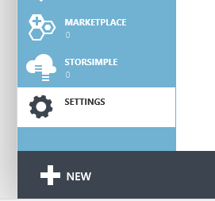
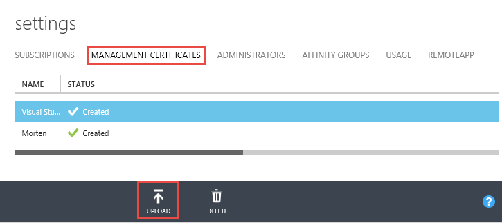

#Docker Machine

Machine lets you create Docker hosts on your local computer through [Hyper-V](https://docs.docker.com/machine/drivers/hyper-v) or [VirtualBox](https://docs.docker.com/machine/drivers/virtualbox), and on range of different cloud providers - which of course includes [Azure](https://docs.docker.com/machine/drivers/azure).

##Preparing Docker Machine for Azure

Before we can start the `docker-machine.exe` we need to create a certificate that will be uploaded to the Azure portal, as a form of authentication against your Azure subscription.

First, create a local folder and on the command-line, navigate to that folder and type the following command:
```
$ openssl req -x509 -nodes -days 365 -newkey rsa:1024 -keyout mycert.pem -out mycert.pem
$ openssl pkcs12 -export -out mycert.pfx -in mycert.pem -name "My Certificate"
```

>Note: If you get this error "unable to load config info from /usr/local/ssl/openssl.cnf" you might need to specify the absolute path to the openssl config file located in your git folder "C:\Program Files (x86)\Git\ssl\openssl.cnf", and this should be appended at the end of the first command above along with `-config`. So you would enter `openssl` form your git prompt and then `req -x509 -nodes -days 365 -newkey rsa:1024 -keyout mycert.pem -out mycert.pem -config "C:\Program Files (x86)\Git\ssl\openssl.cnf"`

Next, enter the export password for your certificate and capture it for future usage. Then type the following command:
```
$ openssl x509 -inform pem -in mycert.pem -outform der -out mycert.cer
```

As an alternative to openssl you can also use `makecert` if you have that available - possibly through a Visual Studio Developer Command Prompt.
```
makecert -sky exchange -r -n "CN=<CertificateName>" -pe -a sha1 -len 2048 -ss My "<CertificateName>.cer"
```

Now upload your certificate's .cer file to Azure. In the [Azure Portal](https://manage.windowsazure.com/), click Settings in the bottom left of the service area (shown below).



Then choose "Management Certificates" from the top of the Settings page, and click the Upload button at the bottom of that page.



From the upload dialog you need to choose the `mycert.cer` file that was just created.

Once that is done you should click the "Subscriptions" tab (still under Settings) and capture the Azure Subscription Id, which we'll use later.

If you haven't already downloaded Docker Machine, you can find the Docker Machine binaries on the github page for Machine [https://github.com/docker/machine/releases](https://github.com/docker/machine/releases).
Download `docker-machine_windows-386.exe` or `docker-machine_windows-amd64.exe` (unblock if necessary), rename it to `docker-machine.exe` and put it in the same folder as the `docker.exe` on your local machine, 
so that it will part of the PATH variable that should already configured.

##Using Docker Machine to create an Azure VM

Now everything should be in place for actually creating a virtual machine on Azure using `docker-machine.exe`.

>**Note:** In order to create a VM with Docker Machine you'll need the `mycert.pem` file that was created in the previous step.

The shortest form of creating a virtual machine on Azure is using the following command, but please note that it will use a lot of defaults

```
$ docker-machine create -d azure --azure-subscription-id="SUB_ID" --azure-subscription-cert="mycert.pem" --azure-location="LOCATION" A-UNIQUE-NAME-FOR-YOUR-VM
```

The `-d` flag is short-hand for driver, and is the part that tells Machine that we are using the Azure driver.

>Valid locations are: "East US", "South Central US", "Central US", "North Europe", "West Europe", "Southeast Asia", "East Asia"

>You can find all the subcommands in the [Docker Machine subcommands](https://docs.docker.com/machine/reference/) reference documentation.

Here is a list of environment variables and default values

| CLI option                      | Environment variable        | Default                |
|:--------------------------------| ----------------------------| -----------------------|
| `--azure-docker-port`           | -                           | 2376                   |
| `--azure-image`                 | AZURE_IMAGE                 | *Ubuntu 14.04 LTS x64* |
| `--azure-location`              | AZURE_LOCATION              | West US                |
| `--azure-password`              | -                           | -                      |
| `--azure-publish-settings-file` | AZURE_PUBLISH_SETTINGS_FILE | -                      |
| `--azure-size`                  | AZURE_SIZE                  | Small                  |
| `--azure-ssh-port`              | -                           | 22                     |
| `--azure-subscription-cert`     | AZURE_SUBSCRIPTION_CERT     | -                      |
| `--azure-subscription-id`       | AZURE_SUBSCRIPTION_ID       | -                      |
| `--azure-username`              | -                           | ubuntu                 |

Given this information we can refine our creation, so we set the location and the size of the VM.

In the following command we add "West Europe" as the location, and set "Medium" as the size of our VM.
```
$ docker-machine create -d azure --azure-subscription-id="SUB_ID" --azure-subscription-cert="mycert.pem" --azure-location="West Europe" --azure-size="Medium" A-UNIQUE-NAME-FOR-YOUR-VM
```

After running the create command you should see an output similar to the following, which updates the VM after the creation.

```
Running pre-create checks...
Creating machine...
(YOUR_VM_NAME) Creating Azure machine...
Waiting for machine to be running, this may take a few minutes...
Detecting operating system of created instance...
Waiting for SSH to be available...
Detecting the provisioner...
Provisioning with ubuntu(systemd)...
Installing Docker...
Copying certs to the local machine directory...
Copying certs to the remote machine...
Setting Docker configuration on the remote daemon...
Checking connection to Docker...
Docker is up and running!
To see how to connect your Docker Client to the Docker Engine running on this virtual machine, run: <path to docker-machine>\docker-machine.exe env YOUR_VM_NAME
```

Please note the last line with `<path to docker-machine>\docker-machine.exe env YOUR_VM_NAME`, which is what we'll use to set access to the newly created VM from the current terminal session (command prompt).
Prepend eval and run it as follows: `eval $("<path to docker-machine>\docker-machine.exe" env YOUR_VM_NAME)`. This will configure the correct environment variables for working seemlessly with the docker cli tools moving forward.

From your local Docker client you should now be able to run `docker info` and see details about the Azure VM. 