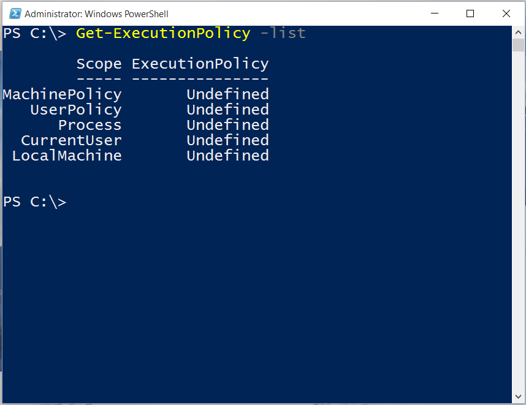
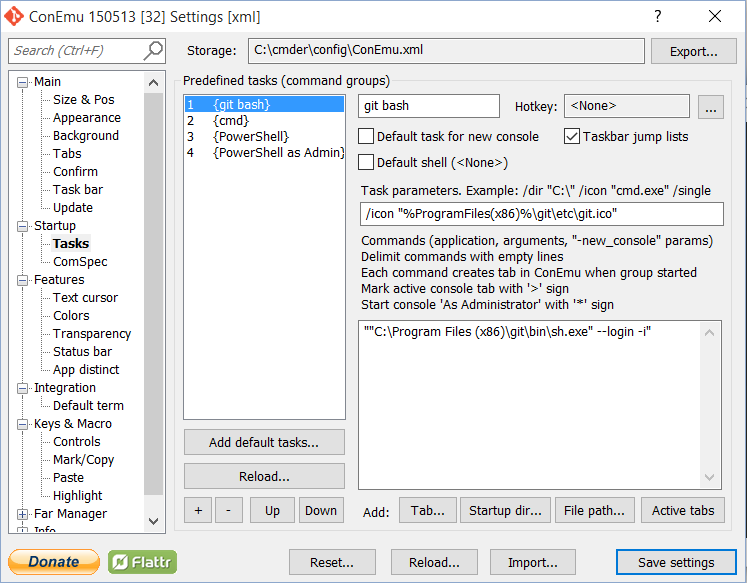
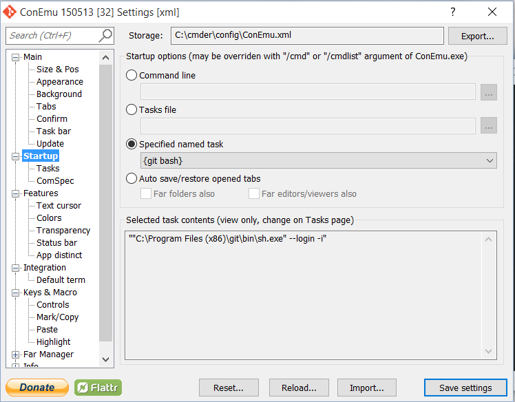
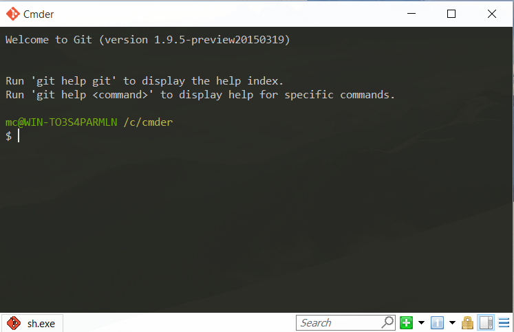

#Getting and configuring Cmder

This step is optional. If you already have a commandline tool, maybe even the built-in Console, that you like to use you are of course free to do so.
We included this step to show how you can configure [Cmder](http://gooseberrycreative.com/cmder/) to open a git shell prompt, which can use the Docker client for all the workbook needs.

Download the "mini" version from [http://gooseberrycreative.com/cmder/](http://gooseberrycreative.com/cmder/) and unzip it in your desired location.

Once you have Cmder unzipped you need to double check that the startup Powershell script is able 
to execute. If you see a Powershell error when clicking on the Cmder.exe, then open up a Powershell 
console with the "Run as Administrator" right-click option. From the Powershell console run the following
command: `Get-ExecutionPolicy -list`

If you see a list similar to the one above, you will need to change it to RemoteSigned. This will enable the Powershell script in Cmder to execute.
Run `Set-ExecutionPolicy RemoteSigned` to change the policy.

Now you are ready to configure Cmder to open a git shell prompt from the Cmder Console.
So open up Cmder and click the Cmder icon in the top left corner and select "Settings" or use Ctrl + Alt + P.

From the Settings menu click Tasks under Startup and enter a new task as shown below

In order to set up the "git bash" configuration as the default (this is of course optional as well) 
click the Startup item in the Settings menu and select {git bash} under "Specified named task" as shown below.

Save settings and close Cmder, then open it again to verify that it starts with the desired git shell as shown below. 
Remember that you can always open another tab in Cmder if you want to use Powershell or a regular Windows command prompt.

 