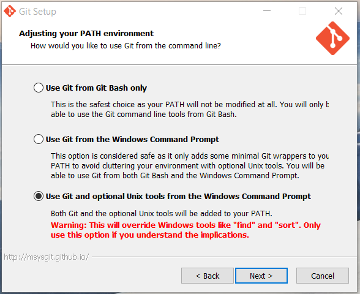
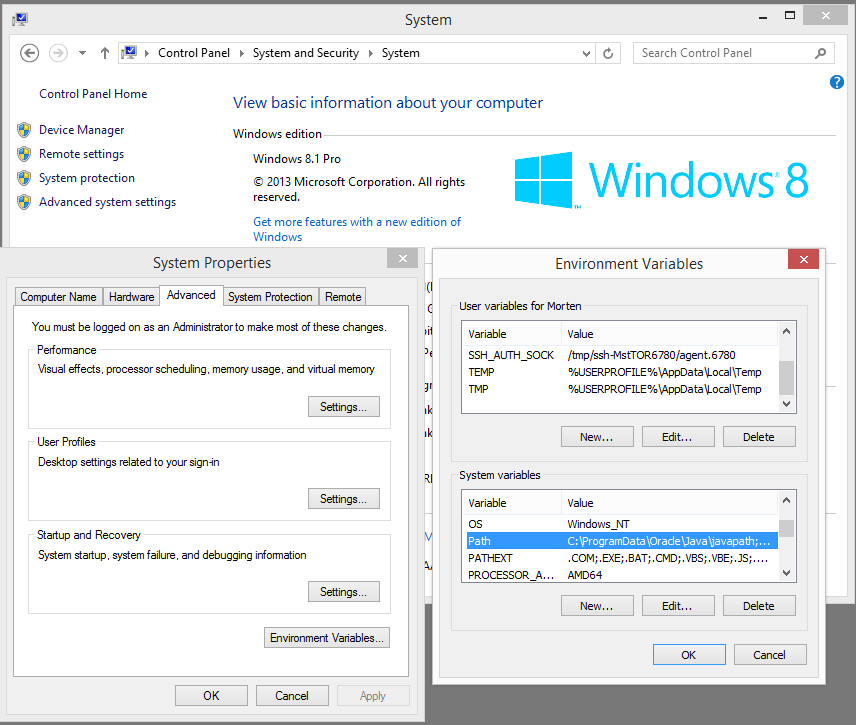

#Installing and configuring git

Having git installed on your local machines will give you access to a shell prompt from the 
commandline, which we are going to use when working against a remote Docker engine. 
Either on Azure or in another (virtual) machine in your local lab.

Download the latest version of git for Windows or Mac OS X from [git-scm.com](https://git-scm.com/download) and start the installer.

During the installation (on Windows) you want to select the option gives you both git and unix tools, and adds them to your Windows PATH.



If you already have git installed, you might want to double check that its been added to the PATH 
and that you can enter the shell command from your command prompt: `sh.exe --login -i`

You can edit the content of your PATH under Control Panel > System > Advanced System Settings
Advanced (tab) > Environment Variables (button) > System Variables



Alternatively, run the following command from your Command Line Prompt (cmd.exe):
```
set PATH=%PATH%;"c:\Program Files (x86)\Git\bin"
```